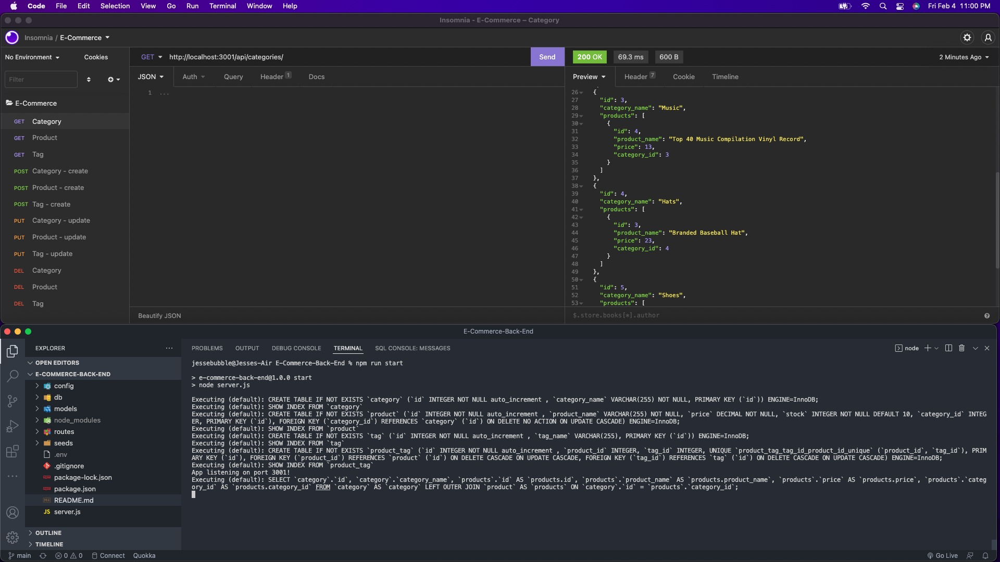

# E-Commerce Back End Project 💡
- Took a working `ExpressJS API` and configured it to use `Sequelize ORM` to interact w/ `MySQL database`

## Video Walkthrough 🎥
<a href="https://watch.screencastify.com/v/CNmBrPyrZmVnKMTsIg4J">Screencastify Walkthrough Video</a>

## Description 📓

- Build the Back End for an E-Commerce Site. 
- Take a working ExpressJS API and configure it to use Sequelize to interact with a MySQL database.
- Use the MySQL2 and Sequelize packages to connect your ExpressJS API to a MySQL database.
- Dotenv package will use environment variables to store sensitive data, like your MySQL username, password, and database name.
- Database should contain the following four models: Category, Product, Tag, ProductTag
- After creating the models and routes, run `npm run seed` to seed data to your database so that you can test your routes.
- Update `server.js` to sync the Sequelize models to the MySQL database on server start.
